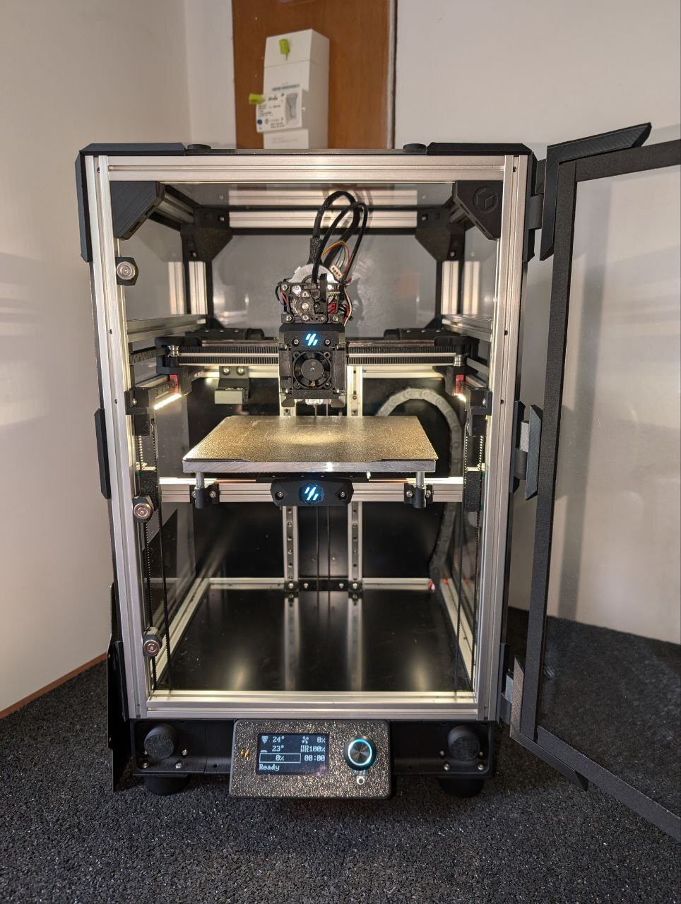
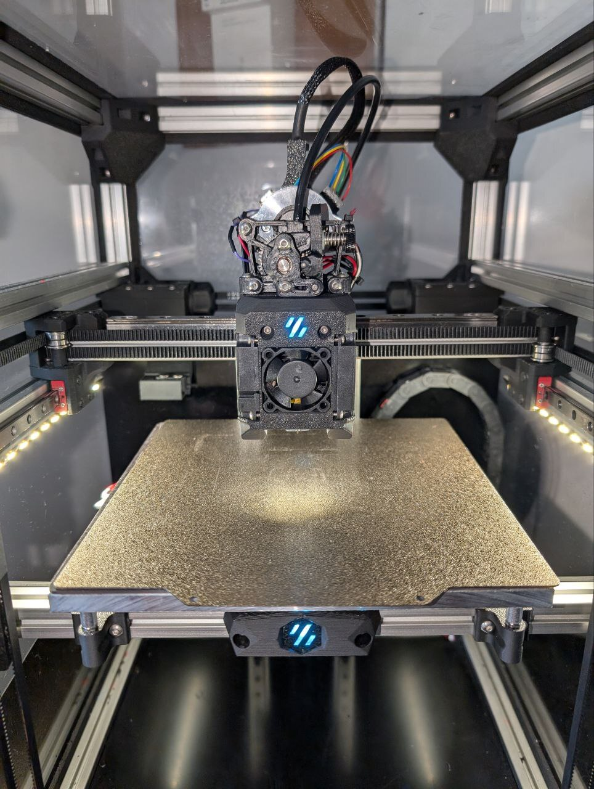

# Boxed Tri-Zero Plus - V0.3101 -

This is a repo regrouping infos about my Tri-Zero build, in plus size (170mm).

Config :
 - Voron [Tri-Zero](https://github.com/zruncho3d/tri-zero) mod by [zruncho3d](https://github.com/zruncho3d)
 - With [BoxZero](https://github.com/zruncho3d/BoxZero) mod
 - And [ZeroPanels](https://github.com/zruncho3d/ZeroPanels)
 - Using [chirpy's](https://github.com/chirpy2605) [Dragon Burner](https://github.com/chirpy2605/voron/tree/main/V0/Dragon_Burner) toolhead (in v5)
 - And [Sherpa Mini](https://github.com/Annex-Engineering/Sherpa_Mini-Extruder) extruder

---

The file `sourcing_t0+.ods` is something many peapople asked, it contains :
 - My inventory of parts to be printed (tab `Prints`)
 - The BOM I used for this build (tab `BOM`), included links if available
 - A pre-built wiring check (tab `Wiring`)
 - And a costs recap (tab `Costs`)

I'm from France, so prices are Euros €.

|  |  |
| - | - |
| Details with door open | Detail of the toolhead |
